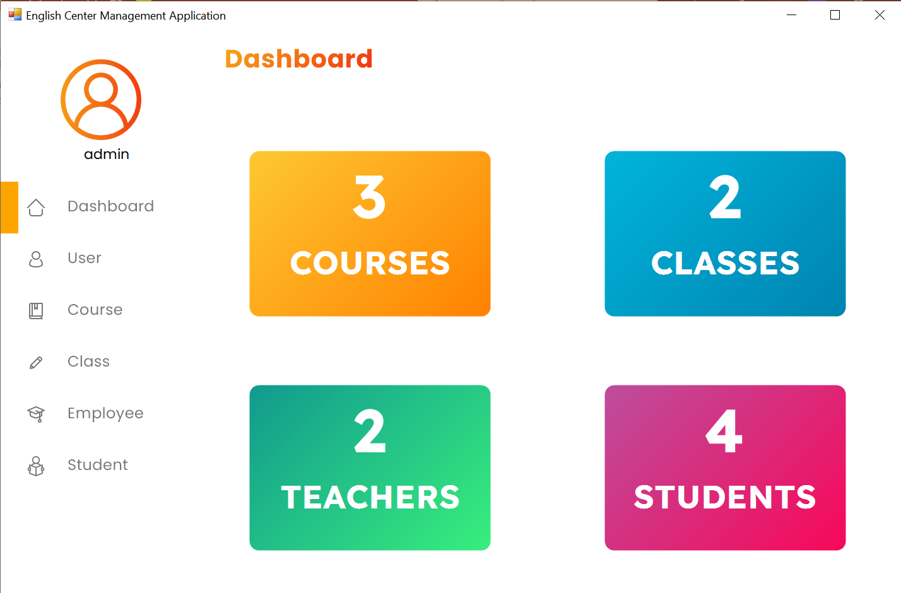

<h1 align="center">
  <br>
  
  <br>
  EnglishCenterManagament
  <br>
</h1>

<h4 align="center">A desktop application for managing an english education center</h4>

<p align="center">
    
    
    
</p>

<p align="center">
  <a href="#key-features">Key Features</a> •
  <a href="#how-to-use">How To Use</a> •
  <a href="#credits">Credits</a> •
  <a href="#authors">Authors</a> •
</p>



## Key Features

* User Management
* Course Management
* Class Management
* Grading
* Employee Management
* Student Management

## How To Use

To clone and run this application, you'll need [Git](https://git-scm.com) and [Visual Studio](https://visualstudio.microsoft.com/downloads/) installed on your computer. From your command line:

```bash
# Clone this repository
$ git clone https://github.com/Doan-Pham/EnglishCenterManagement
```
Then open EnglishCenterManagemenent.sln at the root directory, click Start (F5) to run the program.

## Credits

This software uses the following resources and packages:

- UI Components: [Krypton](https://github.com/ComponentFactory/Krypton)
- Icons: [FontAwesome](https://fontawesome.com/icons)

## Authors

  - [**Pham Truong Hai Doan**](https://github.com/Doan-Pham) - *Teamd Leader, UI Designer, Main Contributor*

  - [**Nguyen Phan Quoc Thien**](https://github.com/npq-thien) - *Contributor*
